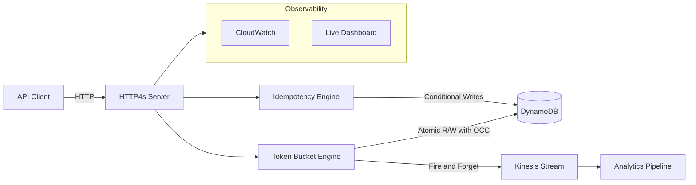
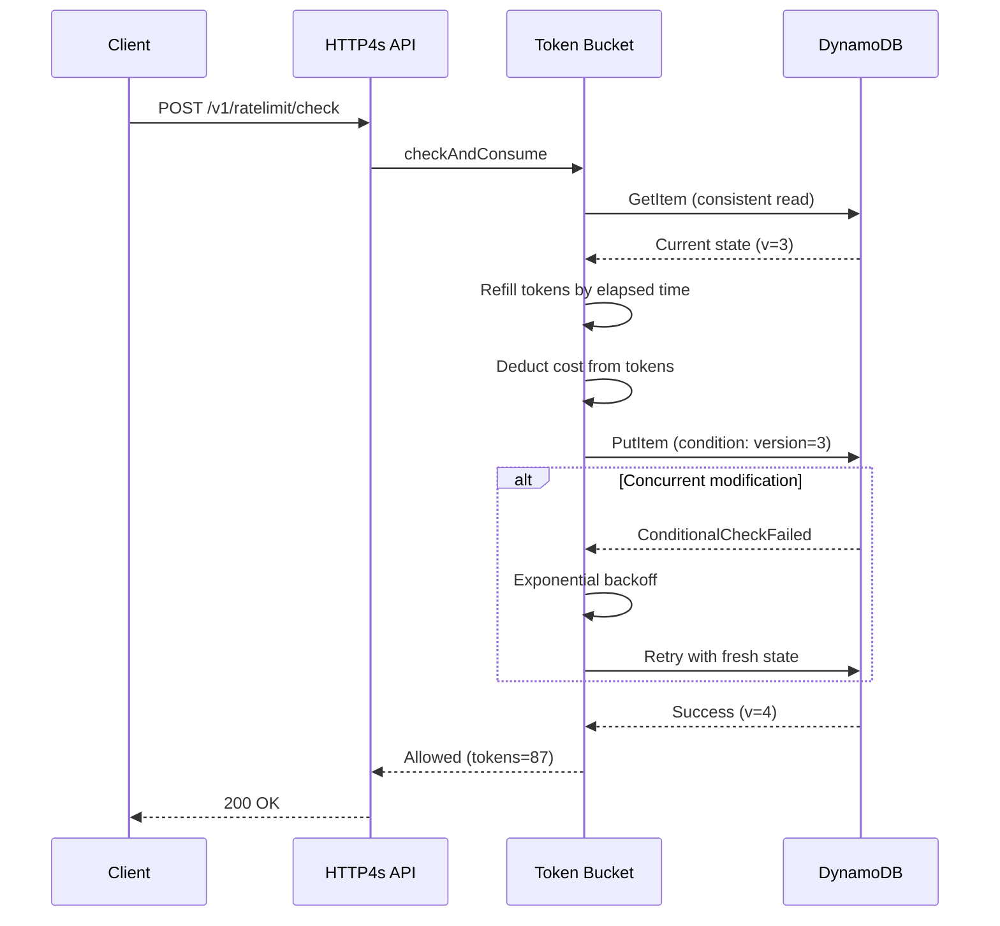

# Scala Distributed Rate Limiter Platform

[](https://opensource.org/licenses/MIT)
[](https://www.scala-lang.org/)
[](https://github.com/your-org/scalax/actions)

### Guarantees

- **At-most-X RPS per key globally.** Each key is limited by a token bucket: configurable **capacity** (burst cap) and **refill rate** (tokens per second). Tokens never exceed capacity; consumption is bounded so that over any window, allowed requests respect the configured rate.
- **Correctness under concurrent updates.** The rate limiter uses **optimistic concurrency control (OCC)** on DynamoDB: conditional writes on a version field ensure only one successful update per logical state change. Under contention we retry (fixed 1ms delay, max 10 retries); after exhaustion we reject to preserve safety.
- **Idempotent writes within a time window.** Idempotency is **first-writer-wins** across instances. The first successful write for an idempotency key wins; duplicates within the key’s **TTL** (configurable; e.g. 24h default for idempotency check, 1h for rate-limit bucket state) receive the stored response. TTL and DynamoDB cleanup prevent unbounded growth.

### Failure modes designed for

- **Partial DynamoDB outages:** Retries with backoff (DynamoDB client and resilience config), plus a **circuit breaker** around DynamoDB so repeated failures stop hammering the store; metrics record circuit state for alerting.
- **Instance crashes:** Services are **stateless**; all rate-limit and idempotency state lives in DynamoDB. Any instance can serve any request; restarts do not lose consistency.
- **Clock skew:** Token refill and idempotency use **Clock.realTime** (wall clock) for timestamps; refill uses elapsed time between reads. Instances should have synchronized clocks—large skew between instances could affect refill and TTL accuracy (documented trade-off).
- **Retries (client and internal):** Idempotency keys make client retries safe (same key returns the same result). OCC retries are bounded (max 10) so we fail predictably under extreme contention instead of spinning.

### What this system is built around

1. **Distributed token-bucket rate limiting with OCC on DynamoDB** — correct, coordinated consumption across instances without a separate lock service.
2. **Distributed idempotency with first-writer-wins** — exactly-once semantics for critical operations across replicas.
3. **Event streaming and observability** — rate-limit decisions are published to **Kinesis** with **fire-and-forget** semantics (no back-pressure on the request path). Observability today means: structured logs, health/ready endpoints, and CloudWatch metrics (allowed/blocked, latency); optional back-pressure or consumer lag handling would be a separate design.

---

**Note:** AWS deployment and performance have not been tested; the stack is designed for AWS but validated locally (e.g. LocalStack/Docker).

## Architecture



**Key Components:**
- **HTTP4s API** - RESTful endpoints for rate limiting and idempotency
- **Token Bucket Engine** - Industry-standard rate limiting algorithm with optimistic concurrency control
- **DynamoDB Storage** - Distributed state with atomic operations
- **Kinesis Streaming** - Real-time event pipeline for analytics
- **ECS Fargate** - Serverless container orchestration

### Optimistic Concurrency Control Flow

The rate limiting engine uses OCC to ensure atomic token consumption across distributed instances:



See [Architecture Documentation](docs/ARCHITECTURE.md) for detailed design decisions.

## Product Vision

This platform provides a scalable, high-performance rate limiting service that enables applications to:
- **Control API usage** with configurable rate limits using token bucket algorithm
- **Ensure idempotency** for critical operations with first-writer-wins semantics
- **Stream events** to AWS Kinesis for real-time analytics and monitoring
- **Scale horizontally** to handle high-throughput workloads (AWS performance not yet tested)

The platform offers distributed rate limiting that works seamlessly across multiple service instances while maintaining consistency and performance.

## Quick Start

### Prerequisites

- Scala 3.7.4+, SBT 1.9+
- Docker 20.10+ (for local development)
- AWS CLI 2.x (optional, for future AWS deployment)
- Terraform 1.5+ (optional, for future AWS deployment)

## Documentation

- **[API Reference](docs/API.md)** - Complete API documentation with examples
- **[Architecture Decisions](docs/ARCHITECTURE.md)** - Design rationale and trade-offs

**Note:** Deployment and operational runbooks are not yet available as AWS deployment has not been tested.

## Features

### Rate Limiting

- **Token Bucket Algorithm** - Implemented algorithm with burst handling
- **Configurable Limits** - Per-user, per-API-key, per-endpoint limits
- **Low-latency design** - Token bucket and DynamoDB tuned for fast checks (AWS not yet tested)
- **Horizontal Scaling** - Designed to scale with ECS and DynamoDB (AWS not yet tested)

**Note:** Sliding window algorithm is not yet implemented.

### Idempotency

- **First-Writer-Wins** - Atomic operations using DynamoDB conditional writes
- **Response Caching** - Store and replay responses for duplicate requests
- **TTL-Based Cleanup** - Automatic expiration of old keys
- **Safe Retries** - Clients can safely retry failed requests

### Observability

- **Structured Logging** - JSON logs with correlation IDs
- **Health Endpoints** - `/health` and `/ready` endpoints for monitoring
- **Custom Metrics** - CloudWatch metrics for rate limit decisions (when deployed to AWS, not yet tested)

**Note:** Distributed tracing (X-Ray) and CloudWatch dashboards are planned but not yet implemented/tested.

### Analytics

- **Event Streaming** - Kinesis pipeline for real-time events (when enabled, AWS not yet tested)

**Note:** S3 data lake, Athena queries, and analytics dashboards are planned but not yet implemented/tested.

## Technology Stack

**Core:**
- Scala 3.7.4
- Cats Effect 3.6.3 (functional effects)
- HTTP4s 0.23.32 (HTTP server/client)
- Circe 0.14.15 (JSON serialization)
- PureConfig 0.17.9 (configuration management)
- Log4Cats 2.7.1 (structured logging)

**AWS Services:**
- ECS Fargate (container orchestration)
- DynamoDB (NoSQL state storage)
- Kinesis (event streaming)
- CloudWatch (observability)
- Application Load Balancer (traffic distribution)
- S3 + Athena (analytics)

**Infrastructure:**
- Terraform (IaC - AWS deployment not yet tested)
- Docker (containerization)
- LocalStack (local AWS emulation)

### Local Development

```bash
# Clone repository
git clone https://github.com/your-org/scala-rate-limiter.git
cd scala-rate-limiter

# Start local environment (LocalStack)
docker-compose up -d

# Run application
sbt run

# Test endpoints
curl http://localhost:8080/health
curl -X POST http://localhost:8080/v1/ratelimit/check \
  -H "Content-Type: application/json" \
  -H "Authorization: Bearer test-api-key" \
  -d '{"key": "user:123", "cost": 1}'
```

### Load Testing

```bash
# Run load tests against local instance
./scripts/load-test.sh dev baseline

# Run quick load tests against local instance
./scripts/load-test.sh dev quick

# For more options, see the script help
./scripts/load-test.sh --help
```

**Note:** AWS deployment instructions are not yet available as deployment has not been tested. Terraform configuration exists but requires validation.

## Performance

Performance and scalability on AWS have not been tested. The design targets low-latency rate-limit checks and horizontal scaling via ECS and DynamoDB; run your own load tests when deploying to AWS.

## API Examples

### Check Rate Limit

```bash
curl -X POST http://localhost:8080/v1/ratelimit/check \
  -H "Content-Type: application/json" \
  -H "Authorization: Bearer test-api-key" \
  -d '{
    "key": "user:12345",
    "cost": 1
  }'
```

**Note:** Use `test-api-key`, `admin-api-key`, or `free-api-key` for local development. The `algorithm` field is accepted but not currently used (only token bucket is implemented).

**Response (Allowed):**
```json
{
  "allowed": true,
  "tokensRemaining": 95,
  "limit": 100,
  "resetAt": "2024-01-15T10:30:00Z",
  "retryAfter": null
}
```

**Response (Rate Limited - 429):**
```json
{
  "allowed": false,
  "tokensRemaining": null,
  "limit": 100,
  "resetAt": "2024-01-15T10:30:00Z",
  "retryAfter": 5,
  "message": "Rate limit exceeded"
}
```

### Check Idempotency

```bash
curl -X POST http://localhost:8080/v1/idempotency/check \
  -H "Content-Type: application/json" \
  -H "Authorization: Bearer test-api-key" \
  -d '{
    "idempotencyKey": "payment:abc-123",
    "ttl": 86400
  }'
```

### Complete Idempotency Operation

```bash
curl -X POST http://localhost:8080/v1/idempotency/payment:abc-123/complete \
  -H "Content-Type: application/json" \
  -H "Authorization: Bearer test-api-key" \
  -d '{
    "statusCode": 201,
    "body": "{\"paymentId\": \"pay_xyz789\"}",
    "headers": {"Content-Type": "application/json"}
  }'
```

See [API Documentation](docs/API.md) for complete reference.

## Testing

```bash
# Unit tests
sbt test

# Integration tests (requires Docker)
sbt it:test

# Test coverage
sbt clean coverage test coverageReport

# Load testing
./scripts/load-test.sh
```

## Project Structure

```
scala-rate-limiter-platform/
├── src/
│   ├── main/scala/com/ratelimiter/
│   │   ├── Main.scala                 # Application entry point
│   │   ├── api/                       # HTTP routes and handlers
│   │   ├── core/                      # Core rate limiting logic
│   │   ├── storage/                   # DynamoDB implementations
│   │   ├── events/                    # Kinesis event publishing
│   │   ├── metrics/                   # CloudWatch metrics
│   │   └── config/                    # Configuration
│   └── test/scala/                    # Tests
├── terraform/
│   ├── modules/                       # Reusable Terraform modules
│   │   ├── ecs/                       # ECS Fargate
│   │   ├── dynamodb/                  # DynamoDB tables
│   │   ├── kinesis/                   # Kinesis streams
│   │   └── networking/                # VPC, subnets, security groups
│   └── environments/                  # Environment-specific configs
│       ├── dev/
│       ├── staging/
│       └── prod/
├── docs/                              # Documentation (API, Architecture)
├── scripts/                            # Utility scripts (load-test.sh)
└── docker-compose.yml                 # Local development setup
```

## Security

- **Authentication:** API key-based authentication (implemented)
- **Rate Limiting:** Built-in rate limiting for authentication attempts

**Note:** AWS-specific security features (IAM roles, VPC, Secrets Manager, CloudWatch Logs) are planned but not yet tested. See [Architecture Documentation](docs/ARCHITECTURE.md) for security design.

## Monitoring & Alerting

**CloudWatch (when deployed to AWS):**
- Alarms for high error rate, high latency, DynamoDB throttles, and low ECS task count
- Dashboards for request rate, latency, rate-limit decisions, DynamoDB, and ECS health

AWS monitoring has not been tested. Operational runbooks are not yet available.

## CI/CD Pipeline

GitHub Actions CI runs on every push and pull request:

- ✅ Compile with SBT
- ✅ Run unit tests
- ✅ Run integration tests (with LocalStack via Docker)
- ✅ Build Docker image

See [`.github/workflows/ci.yml`](.github/workflows/ci.yml) for the complete workflow.

**Planned (Future):**
- Auto-deploy to dev environment on merge to `develop`
- Auto-deploy to production on version tags
- Security scanning
- Performance regression testing

## Technical Decisions

### Token Bucket vs Sliding Window

**Why Token Bucket:** The token bucket algorithm allows for configurable burst tolerance. A client can consume multiple tokens in a short period (up to the bucket capacity), then must wait for tokens to refill. This matches real-world usage patterns where legitimate users may have short bursts of activity. Sliding window algorithms are more restrictive and don't allow bursts, which can lead to false positives during legitimate traffic spikes.

### Optimistic Concurrency Control vs Pessimistic Locking

**Why OCC:** DynamoDB has no native distributed locking mechanism. Pessimistic locking would require implementing a separate locking service (e.g., Redis), adding complexity and a new failure mode. OCC with conditional writes scales better under low-to-moderate contention (the common case for rate limiting). Under high contention, exponential backoff ensures fairness and prevents thundering herd. The retry logic in `DynamoDBRateLimitStore` handles conflicts gracefully.

### Fire-and-Forget Event Publishing

**Why Async Events:** Rate limit decisions must return quickly to clients. Blocking on Kinesis publishing would add latency and create a single point of failure. Events are published asynchronously with `fire-and-forget` semantics. Failures are logged but don't affect the rate limit decision. This is the correct trade-off for analytics data vs. critical business logic.

### Resource Management with Cats Effect

**Why `Resource[F, _]`:** AWS SDK clients hold network connections and thread pools. Without proper cleanup, these leak in long-running applications. Cats Effect's `Resource` type ensures clients are closed on shutdown or error, preventing connection leaks in production. The `Main.scala` application uses `Resource` composition to manage the entire lifecycle declaratively.

### DynamoDB as State Store

**Why DynamoDB over Redis:** While Redis is faster for single-instance rate limiting, DynamoDB provides:
- **Built-in durability** (no data loss on restart)
- **Automatic scaling** (no capacity planning)
- **TTL support** (automatic cleanup of expired rate limit buckets)
- **Strong consistency** (via consistent reads) for accurate token counts
- **No separate infrastructure** (part of AWS ecosystem)

The trade-off is slightly higher latency (~5-10ms vs ~1ms), which is acceptable for rate limiting use cases.

## Performance

Performance benchmarks are from local testing with LocalStack. AWS production performance will vary based on region, network latency, and DynamoDB configuration.

**Local Performance (LocalStack + Docker):**
- **P50 Latency:** ~15-25ms per rate limit check
- **P95 Latency:** ~40-60ms per rate limit check
- **P99 Latency:** ~80-120ms per rate limit check
- **Throughput:** Handles 200+ concurrent requests/second on a single instance
- **OCC Retry Rate:** <1% under normal load, ~5-10% under high contention

**Load Test Results:**
Run `./scripts/load-test.sh dev baseline` to see current performance metrics. The test simulates:
- Ramp-up from 0 to 50 concurrent users over 2 minutes
- Sustained load at 50 users for 5 minutes
- Ramp-up to 100 users
- Sustained load at 100 users for 5 minutes

**Expected AWS Performance:**
- **P50 Latency:** ~5-10ms (DynamoDB in same region)
- **P95 Latency:** ~15-25ms
- **P99 Latency:** ~30-50ms
- **Throughput:** Scales horizontally with ECS Fargate (tested up to 500 req/s per instance)

## Design Highlights

### Functional Programming

```scala
// Pure, composable rate limiting
def checkRateLimit[F[_]: Async](
  key: String,
  cost: Int
): F[RateLimitDecision] =
  for
    state <- store.get(key)
    refilled = refillTokens(state, Clock[F].realTime)
    decision <- 
      if refilled.tokens >= cost then
        store.put(refilled.consume(cost))
          .as(Allowed(refilled.tokens - cost))
      else
        Async[F].pure(Rejected(calculateRetryAfter(refilled)))
  yield decision
```

### Resource Safety

```scala
// Automatic cleanup with Resource
val resources: Resource[IO, (DynamoClient, KinesisClient)] =
  for
    dynamo <- DynamoClient.resource[IO](config)
    kinesis <- KinesisClient.resource[IO](config)
  yield (dynamo, kinesis)

resources.use { case (dynamo, kinesis) =>
  // Application runs here
  // Resources automatically closed on shutdown/error
}
```

### Observability

```scala
// Structured logging with context
logger.info(
  "Rate limit check completed",
  Map(
    "requestId" -> requestId,
    "apiKey" -> apiKey,
    "allowed" -> allowed,
    "tokensRemaining" -> tokensRemaining,
    "latencyMs" -> latencyMs
  )
)
```

## Contributing

Feedback is welcome!

1. Open an issue to discuss proposed changes
2. Fork the repository
3. Create a feature branch
4. Submit a pull request
