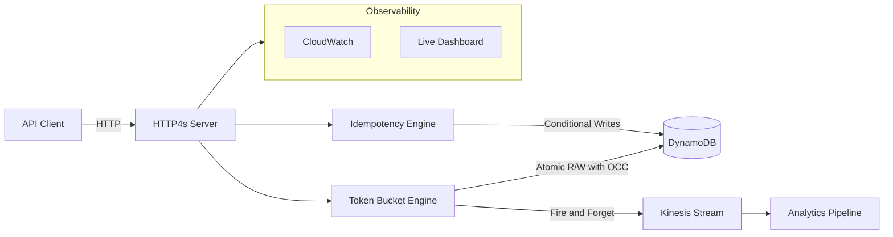
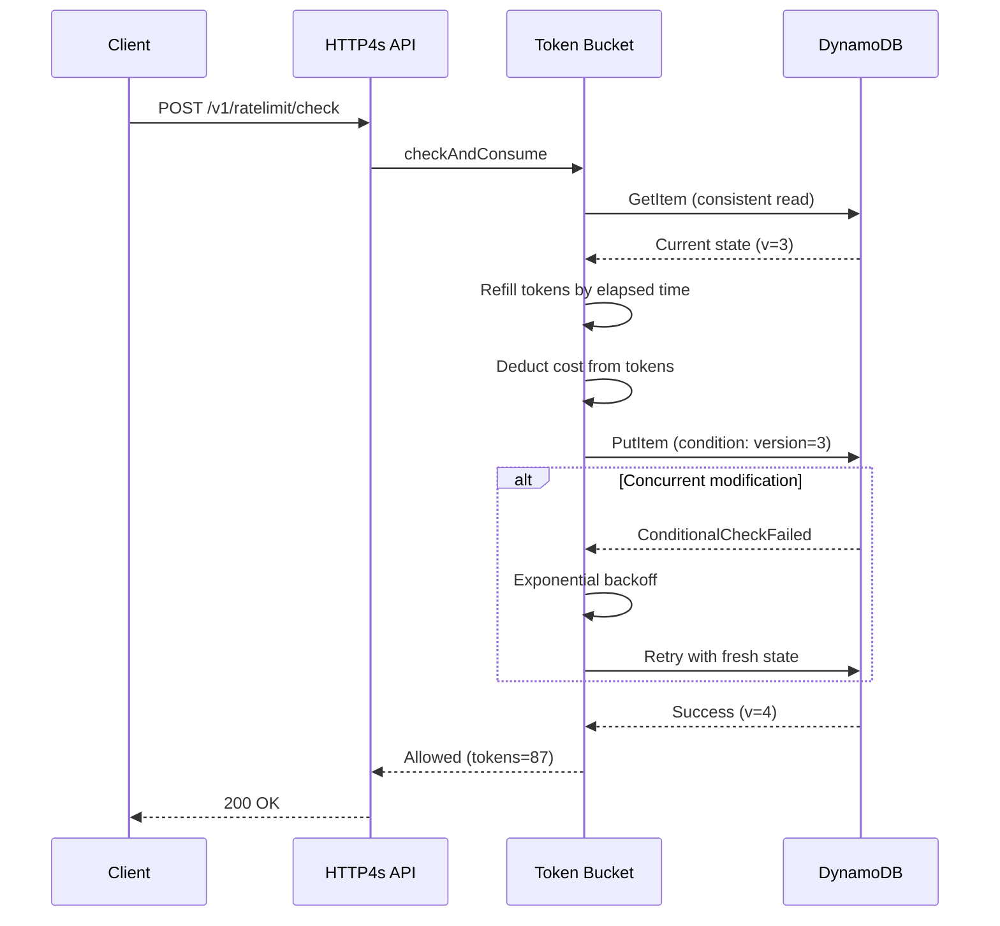

# Scala Distributed Rate Limiter Platform

[](https://opensource.org/licenses/MIT)
[](https://www.scala-lang.org/)
[](https://github.com/your-org/scalax/actions)

A distributed rate limiter and idempotency service built with Scala 3, Cats Effect, and DynamoDB. Enforces per-key request limits correctly across multiple stateless instances — without a lock service.

### What this system guarantees

| Guarantee | Mechanism |
|-----------|-----------|
| **At-most-X RPS per key, globally** | Token bucket per key stored in DynamoDB; OCC (version-based conditional writes) ensures only one instance consumes tokens per logical state change. Tokens never exceed capacity; over any window, allowed requests respect the configured rate. |
| **Idempotent operations within TTL** | First-writer-wins via DynamoDB conditional `PutItem`. The first successful write for a key wins; duplicates within the TTL window receive the stored response. TTL auto-expiry prevents unbounded table growth. |
| **Stateless instances** | All rate-limit and idempotency state lives in DynamoDB. Any instance can serve any request; crashes and restarts lose no consistency. |

### What this system is designed to survive

| Failure mode | Behaviour |
|-------------|-----------|
| **Partial DynamoDB outage** | DynamoDB client retries with backoff; a circuit breaker stops hammering a failing store. Rate-limit store fails open (allow) on corrupt state with an `ERROR` log and `CorruptStateRead` metric. Readiness probe removes the instance from rotation on dependency failure. |
| **Instance crash** | No in-process state. The next instance reads current DynamoDB state and continues correctly. |
| **Kinesis failure** | Bounded in-memory queue drains to Kinesis; on transient failure one retry, then drop with `DroppedKinesisEvent` metric. The request path is never blocked waiting for Kinesis. |
| **OCC exhaustion under extreme contention** | After 10 failed conditional writes for the same key in the same window, the request is **rejected** (429). The service under-issues at the tail rather than over-issuing past the rate limit. |

### Three hard problems this is built around

1. **Distributed token-bucket correctness** — coordinating token consumption across instances without a separate lock service. OCC on DynamoDB version fields is the mechanism; see [OCC flow](#optimistic-concurrency-control-flow) and [performance characteristics](docs/ARCHITECTURE.md).
2. **Idempotency under concurrency** — exactly-one-Created semantics when many concurrent callers hit the same key simultaneously. Conditional writes (`attribute_not_exists(pk)`) plus consistent reads are the mechanism; see [Idempotency](#idempotency).
3. **Back-pressure on event publishing** — Kinesis publishing must not block the request path or lose events silently. A bounded queue with a background drain fiber and observable drop counter is the mechanism; see [Metrics](#metrics).

---

**Note:** AWS deployment and performance have not been tested end-to-end; the stack is designed for AWS but validated locally with LocalStack/Docker.

## Architecture



**Key Components:**
- **HTTP4s API** - RESTful endpoints for rate limiting and idempotency
- **Token Bucket Engine** - Industry-standard rate limiting algorithm with optimistic concurrency control
- **DynamoDB Storage** - Distributed state with atomic operations
- **Kinesis Streaming** - Real-time event pipeline for analytics
- **ECS Fargate** - Serverless container orchestration

### Optimistic Concurrency Control Flow

The rate limiting engine uses OCC to ensure atomic token consumption across distributed instances:



See [Architecture Documentation](docs/ARCHITECTURE.md) for detailed design decisions.

## Quickstart in 5 Minutes

> Prerequisites: Docker 20.10+ and `docker-compose`. No AWS account needed for local development.

**Step 1 — Start LocalStack (DynamoDB + Kinesis emulation)**

```bash
docker-compose up -d
```

Expected output: LocalStack container starts; the init script creates the DynamoDB tables and Kinesis stream automatically.

**Step 2 — Verify the service is alive**

```bash
curl http://localhost:8080/health
```

```json
{ "status": "healthy", "version": "0.2.0" }
```

**Step 3 — Check a rate limit (allowed)**

```bash
curl -s -X POST http://localhost:8080/v1/ratelimit/check \
  -H "Content-Type: application/json" \
  -H "Authorization: Bearer test-api-key" \
  -d '{"key": "user:demo", "cost": 1}' | jq .
```

```json
{
  "allowed": true,
  "tokensRemaining": 99,
  "limit": 100,
  "resetAt": "2025-01-15T10:30:05Z",
  "retryAfter": null
}
```

**Step 4 — Exhaust the bucket (rate-limited response)**

Run this ~105 times quickly to drain the `basic` tier bucket (100 token capacity):

```bash
# bash / zsh
for i in $(seq 1 105); do
  curl -s -X POST http://localhost:8080/v1/ratelimit/check \
    -H "Content-Type: application/json" \
    -H "Authorization: Bearer test-api-key" \
    -d '{"key": "user:demo", "cost": 1}' | jq -r '.allowed'
done
```

After ~100 successful requests, the bucket empties and the service returns 429:

```json
{
  "allowed": false,
  "tokensRemaining": null,
  "limit": 100,
  "resetAt": "2025-01-15T10:30:05Z",
  "retryAfter": 5,
  "message": "Rate limit exceeded"
}
```

**Step 5 — Idempotent POST (first call — New)**

```bash
curl -s -X POST http://localhost:8080/v1/idempotency/check \
  -H "Content-Type: application/json" \
  -H "Authorization: Bearer test-api-key" \
  -d '{"idempotencyKey": "payment:demo-001", "ttl": 3600}' | jq .
```

```json
{ "status": "new", "idempotencyKey": "payment:demo-001" }
```

**Step 6 — Replay the same key (duplicate detected)**

```bash
curl -s -X POST http://localhost:8080/v1/idempotency/check \
  -H "Content-Type: application/json" \
  -H "Authorization: Bearer test-api-key" \
  -d '{"idempotencyKey": "payment:demo-001", "ttl": 3600}' | jq .
```

```json
{ "status": "in_progress", "idempotencyKey": "payment:demo-001" }
```

The second call sees the existing `Pending` record and returns `in_progress` — the client knows not to rerun the payment. Once the operation is completed via `/v1/idempotency/:key/complete`, further replays return `duplicate` with the stored response body.

---

## Infrastructure / Deploy

Terraform provisions the following AWS resources ([`terraform/`](terraform/)):

| Resource | What it does |
|---|---|
| **DynamoDB** `rate-limits` | Token-bucket state per key (OCC on version field) |
| **DynamoDB** `idempotency` | Idempotency key storage with TTL auto-expiry |
| **Kinesis** `rate-limit-events` | Rate-limit decision event stream |
| **ECS Fargate** | Containerised app; autoscaling 2–10 tasks |
| **ALB** | Application Load Balancer fronting ECS |
| **VPC / subnets** | Private subnets for ECS, public subnets for ALB |

All variables are in [`terraform/variables.tf`](terraform/variables.tf). `container_image` is the only **required** variable (no default); all others have sensible defaults.

**Key variables**

| Variable | Default | Description |
|---|---|---|
| `container_image` | *(required)* | Docker image URI (e.g. ECR) |
| `aws_region` | `us-east-1` | AWS region |
| `environment` | `dev` | Environment tag applied to all resources |
| `ecs_desired_count` | `2` | Number of running ECS tasks |
| `ecs_cpu` / `ecs_memory` | `256` / `512` | Container vCPU units and memory (MB) |
| `dynamodb_billing_mode` | `PAY_PER_REQUEST` | `PAY_PER_REQUEST` or `PROVISIONED` |
| `kinesis_shard_count` | `1` | Number of Kinesis shards |
| `enable_autoscaling` | `true` | ECS target-tracking autoscaling (min 2, max 10 tasks) |
| `alarm_sns_topic_arn` | `""` | SNS topic for CloudWatch alarms (optional) |

**Deploy to dev**

```bash
cd terraform
terraform init
terraform plan \
  -var-file=environments/dev.tfvars \
  -var="container_image=ACCOUNT.dkr.ecr.REGION.amazonaws.com/rate-limiter:latest"
terraform apply \
  -var-file=environments/dev.tfvars \
  -var="container_image=ACCOUNT.dkr.ecr.REGION.amazonaws.com/rate-limiter:latest"
```

Example [`terraform/environments/dev.tfvars`](terraform/environments/dev.tfvars):

```hcl
environment             = "dev"
ecs_desired_count       = 1
ecs_cpu                 = 256
ecs_memory              = 512
kinesis_shard_count     = 1
kinesis_retention_hours = 24
# container_image = "123456789.dkr.ecr.us-east-1.amazonaws.com/rate-limiter:latest"
```

After apply, retrieve the ALB DNS name:

```bash
terraform output api_endpoint
```

## Documentation

- **[API Reference](docs/API.md)** - Complete API documentation with examples
- **[Architecture Decisions](docs/ARCHITECTURE.md)** - Design rationale and trade-offs

## Configuration

All settings are in [`src/main/resources/application.conf`](src/main/resources/application.conf) and can be overridden via environment variables.

### Per-tier rate limit profiles

Profiles set the burst cap (capacity) and steady-state throughput (refill rate) per client tier. Named profiles override tier defaults when the `profile` field is supplied in a rate-limit check request.

| Profile | Capacity (burst) | Refill rate | TTL |
|---|---|---|---|
| `free` | 20 tokens | 2 req/s | 1 h |
| `basic` | 100 tokens | 10 req/s | 1 h |
| `premium` | 1 000 tokens | 100 req/s | 1 h |
| `enterprise` | 10 000 tokens | 1 000 req/s | 1 h |

Profile lookup is O(1) — profiles are stored as `Map[String, RateLimitProfile]` built at startup. Invalid profiles (capacity < 1, refillRate ≤ 0, empty name) cause a startup failure.

### Key environment variable overrides

| Env var | Config key | Default |
|---|---|---|
| `RATE_LIMIT_ALGORITHM` | `rate-limit.algorithm` | `token-bucket` |
| `RATELIMIT_DEFAULT_CAPACITY` | `rate-limit.default-capacity` | `100` |
| `RATELIMIT_DEFAULT_REFILL_RATE` | `rate-limit.default-refill-rate-per-second` | `10.0` |
| `IDEMPOTENCY_DEFAULT_TTL` | `idempotency.default-ttl-seconds` | `86400` (24 h) |
| `IDEMPOTENCY_MAX_TTL_SECONDS` | `idempotency.max-ttl-seconds` | `86400` (24 h) |
| `KINESIS_ENABLED` | `kinesis.enabled` | `true` |
| `KINESIS_QUEUE_SIZE` | `kinesis.queue-size` | `10000` |
| `METRICS_ENABLED` | `metrics.enabled` | `true` |
| `METRICS_MAX_BUFFER_SIZE` | `metrics.max-buffer-size` | `50000` |
| `METRICS_FLUSH_THRESHOLD` | `metrics.flush-threshold` | `1000` |
| `AUTH_ENABLED` | `security.authentication.enabled` | `true` |
| `CIRCUIT_BREAKER_ENABLED` | `resilience.circuit-breaker.enabled` | `true` |
| `BULKHEAD_MAX_CONCURRENT` | `resilience.bulkhead.max-concurrent` | `100` |

See [`application.conf`](src/main/resources/application.conf) for the complete reference.

## Health and Readiness

The service exposes two probe endpoints on the same HTTP port (`8080`):

### `GET /health` — liveness

Returns `200 OK` whenever the process is alive. No dependency checks are performed. Use for container liveness probes; failure means the container should be restarted.

```json
{ "status": "healthy", "version": "0.2.0" }
```

### `GET /ready` — readiness

Pings all upstream dependencies and returns `200 OK` only when all pass. Returns `503 Service Unavailable` with a `failing` list on any failure. Use for load-balancer health checks and Kubernetes readiness probes — failure removes the instance from rotation without restarting it.

**Dependencies checked:**

| Check key | Dependency |
|---|---|
| `dynamodb_ratelimit` | DynamoDB rate-limits table |
| `dynamodb_idempotency` | DynamoDB idempotency table |
| `kinesis` | Kinesis stream |

**200 response:**
```json
{ "status": "ready", "checks": { "dynamodb_ratelimit": true, "dynamodb_idempotency": true, "kinesis": true } }
```

**503 response (one or more dependencies failing):**
```json
{
  "status": "not ready",
  "checks": { "dynamodb_ratelimit": false, "dynamodb_idempotency": true, "kinesis": true },
  "failing": ["DynamoDB (rate-limit): Connection refused"]
}
```

Each failure is logged at `WARN` level so log-based alerts can be wired upstream.

## Metrics

Metrics are published to **CloudWatch** when deployed to AWS via [`MetricsPublisher`](src/main/scala/metrics/MetricsPublisher.scala).

### Key metrics

| Metric name | Unit | Description |
|---|---|---|
| `RateLimitAllowed` | Count | Requests allowed through |
| `RateLimitBlocked` | Count | Requests rejected (rate limit exceeded) |
| `RateLimitOCCRetry` | Count | OCC conditional-write retries; high values indicate key contention |
| `RateLimitLatency` | Milliseconds | End-to-end latency of a rate-limit check |
| `DroppedKinesisEvent` | Count | Events dropped because the drain queue was full; indicates Kinesis back-pressure |
| `CorruptStateRead` | Count | DynamoDB items with unparseable state; non-zero indicates data issues |

### Flush behaviour

Metrics are buffered in memory and flushed to CloudWatch:
- **Periodic:** every `metrics.flush-interval = 60s`
- **Threshold:** when buffer reaches `metrics.flush-threshold = 1000` entries (async flush triggered immediately)
- **Shutdown:** `Resource.onFinalize` flushes remaining entries before the process exits

Buffer is capped at `metrics.max-buffer-size = 50000` entries; oldest entries are dropped when full (observable via `DroppedMetric` if added).

### CloudWatch namespace

Default namespace: `RateLimiter`. Override with `METRICS_NAMESPACE`.

### Prometheus / custom backends

To export to Prometheus or another system, implement the `MetricsPublisher[F]` interface and wire it in `Main.scala`. No other changes needed.

## Features

### Rate Limiting

- **Token Bucket Algorithm** - Default; allows burst up to capacity.
- **Leaky Bucket Algorithm** - Optional; smooths output (steady drain), no large burst. Select via rate-limit.algorithm.
- **Configurable Limits** - Per-user, per-API-key, per-endpoint limits.
- **Low-latency design** - Token bucket and DynamoDB tuned for fast checks (AWS not yet tested).
- **Horizontal Scaling** - Designed to scale with ECS and DynamoDB (AWS not yet tested).

### Rate limit algorithms

| Aspect     | Token bucket (default)   | Leaky bucket        |
|-----------|--------------------------|---------------------|
| Bursts    | Allows burst to capacity | Smooths; no burst   |
| Fairness  | Burst then refill        | Steady drain        |
| Complexity| Low (2 state vars)       | Low (2 state vars)  |
| DynamoDB  | One item, OCC            | Same                |
| Use case  | APIs that allow burst    | Strict smooth rate  |

Set rate-limit.algorithm = "token-bucket" or "leaky-bucket" in configuration (or RATE_LIMIT_ALGORITHM env) to choose. Local development (localstack) uses in-memory store regardless of algorithm.

### Idempotency

- **First-Writer-Wins** - Atomic operations using DynamoDB conditional writes
- **Response Caching** - Store and replay responses for duplicate requests
- **TTL-Based Cleanup** - Automatic expiration of old keys
- **Safe Retries** - Clients can safely retry failed requests

**Idempotency – schema and semantics**

- **Key:** One item per key; partition key is `idempotency#<key>`. Consistent reads ensure up-to-date status.
- **TTL:** Set at creation (`now + ttlSeconds`). DynamoDB TTL deletes expired items so the table does not grow without bound.
- **First writer wins:** First successful create (no existing key, or status `Failed`) gets **New**; others get **InProgress** or **Duplicate** with stored response. Complete is conditional on `status = Pending`.
- **Same request vs new:** Same key within TTL = retry/replay (InProgress or Duplicate). Different key or same key after TTL expiry = new request (New).
- **Config:** Per-request TTL via `POST /v1/idempotency/check` body field `ttl`, or server default (e.g. 24h). Server enforces a maximum TTL (`idempotency.max-ttl-seconds` or `IDEMPOTENCY_MAX_TTL_SECONDS`); client-supplied TTL above that is capped.

### Observability

- **Structured Logging** - JSON logs with correlation IDs
- **Health Endpoints** - `/health` and `/ready` endpoints for monitoring
- **Custom Metrics** - CloudWatch metrics for rate limit decisions (when deployed to AWS, not yet tested)

**Note:** Distributed tracing (X-Ray) and CloudWatch dashboards are planned but not yet implemented/tested.

### Analytics

- **Event Streaming** - Kinesis pipeline for real-time events (when enabled, AWS not yet tested)

**Note:** S3 data lake, Athena queries, and analytics dashboards are planned but not yet implemented/tested.

## Technology Stack

**Core:**
- Scala 3.7.4
- Cats Effect 3.6.3 (functional effects)
- HTTP4s 0.23.32 (HTTP server/client)
- Circe 0.14.15 (JSON serialization)
- PureConfig 0.17.9 (configuration management)
- Log4Cats 2.7.1 (structured logging)

**AWS Services:**
- ECS Fargate (container orchestration)
- DynamoDB (NoSQL state storage)
- Kinesis (event streaming)
- CloudWatch (observability)
- Application Load Balancer (traffic distribution)
- S3 + Athena (analytics)

**Infrastructure:**
- Terraform (DynamoDB, Kinesis, ECS Fargate, ALB; see [Infrastructure](#infrastructure))
- Docker (containerization)
- LocalStack (local AWS emulation)

### Local Development

```bash
# Clone repository
git clone https://github.com/your-org/scala-rate-limiter.git
cd scala-rate-limiter

# Start local environment (LocalStack)
docker-compose up -d

# Run application
sbt run

# Test endpoints
curl http://localhost:8080/health
curl -X POST http://localhost:8080/v1/ratelimit/check \
  -H "Content-Type: application/json" \
  -H "Authorization: Bearer test-api-key" \
  -d '{"key": "user:123", "cost": 1}'
```

### Load Testing

**k6 scenarios** (requires [k6](https://k6.io/docs/get-started/installation/)):

```bash
# Quick smoke test (30s, 10 VUs, many unique keys)
./scripts/load-test.sh dev quick

# Baseline: ramp 0→50→100 VUs over 16 minutes, many unique keys
./scripts/load-test.sh dev baseline

# High-contention: 50 VUs all hammering the same key for 60s
# Purpose: stress OCC retry path, measure latency and rejection rate under hot-key load
./scripts/load-test.sh dev highContention
```

**Scala load simulator** (no k6 required):

```bash
# Start the server first:
make dev   # or: docker-compose up -d && sbt run

# Then run a scenario:
sbt "loadSim/run --scenario normal"          # 20 VUs, 500 unique keys, 60s
sbt "loadSim/run --scenario burst"           # 50 VUs, 50 keys (more contention), 60s
sbt "loadSim/run --scenario idempotency"     # 30 VUs, 5 shared keys — verifies exactly-one-Created
sbt "loadSim/run --scenario realistic"       # 40 VUs, 80% rate-limit / 20% idempotency
sbt "loadSim/run --scenario highContention"  # 50 VUs, 1 fixed key — OCC stress test
```

| Scenario | VUs | Keys | Purpose |
|----------|-----|------|---------|
| `normal` | 20 | 500 | Base throughput, many unique keys |
| `burst` | 50 | 50 | Token refill behaviour under burst |
| `idempotency` | 30 | 5 | Exactly-one-Created under concurrency |
| `realistic` | 40 | 200 | Mixed traffic (80/20 split) |
| `highContention` | 50 | **1** | OCC retry stress, latency and rejection rate |

See [Benchmark Results](#benchmark-results) for observed numbers from each scenario.

**Note:** AWS deployment instructions are not yet available as deployment has not been tested. Terraform configuration exists but requires validation.

<a name="benchmark-results"></a>

## Benchmark Results

> Numbers are from local testing with LocalStack + Docker on a 6-core dev machine. AWS production performance will differ based on region and DynamoDB configuration.

### Scenario 1 — Many keys (normal load)

Scala loadSim: 20 VUs, 500 unique keys, 60 seconds. k6 quick: 10 VUs, 1,000 keys, 30 seconds.

| Metric | loadSim `normal` | k6 `quick` |
|--------|-----------------|------------|
| Total requests | 3,014 | 300 |
| Throughput | ~50 RPS | ~10 RPS |
| Allowed | 100% | 100% |
| Blocked | 0% | 0% |
| Errors | 0 | 0% |
| P50 latency | — | 49 ms |
| P95 latency | — | 98 ms |
| P99 latency | — | 305 ms |

**Takeaway:** With many unique keys, virtually no OCC contention occurs — every request succeeds on the first conditional write attempt. All tokens remain available because VUs spread across hundreds of keys never exhaust any single bucket. Latency is dominated by LocalStack networking overhead; expect significantly lower latency against real DynamoDB in the same region.

---

### Scenario 2 — Single hot key (highContention)

50 VUs all targeting `contention:single-hot-key` for 60 seconds. Every request races on the same DynamoDB item — worst case for OCC.

| Metric | loadSim `highContention` | k6 `highContention` |
|--------|-------------------------|---------------------|
| Total requests | 284 | 700 |
| Throughput | ~4 RPS | ~8 RPS |
| Allowed | 104 (36%) | 409 (58%) |
| Blocked (429) | 180 (63%) | 291 (42%) |
| P50 latency | — | 3.33 s |
| P90 latency | — | 9.97 s |
| P95 latency | — | 11.25 s |
| P99 latency | — | 13.25 s |
| Avg latency | 9,693 ms | 4,400 ms |
| Max latency | 17,836 ms | 15,770 ms |

**Takeaway:** Throughput drops from ~50 RPS to 4–8 RPS — a **6–12× reduction** — solely from OCC contention on a single key. With 50 VUs racing on one DynamoDB item, most conditional writes fail and must retry (re-read + re-write), up to 10 times per attempt. P99 latency climbs to 13 seconds. The allowed/blocked split varies between runs (36–58% allowed) depending on LocalStack state and timing; the bucket refills between contended rounds so it is not permanently empty.

The k6 thresholds intentionally fail under this scenario — they are tuned for normal multi-key traffic:

```
✗ p(99)<200ms   → actual 13.25s     (OCC retries dominate)
✗ p(95)<500ms   → actual 11.25s
✗ error rate<1% → actual 41.57%     (429s counted as failures by k6)
```

To observe OCC retries in production: watch the `RateLimitOCCRetry` CloudWatch metric. A spike that coincides with latency spikes confirms the retry overhead as the source. This is the honest cost of distributed correctness without a lock service — the system stays **safe** (never over-issues) at the expense of throughput and tail latency under hot-key load.

---

### Scenario 3 — All loadSim scenarios summary

| Scenario | VUs | Keys | Total | RPS | Allowed | Blocked | Notes |
|----------|-----|------|-------|-----|---------|---------|-------|
| `normal` | 20 | 500 | 3,014 | ~50 | 100% | 0% | Baseline — no contention |
| `burst` | 50 | 50 | 1,935 | ~32 | 100% | 0% | More keys-per-VU contention lowers RPS |
| `idempotency` | 30 | 5 | 524 | ~17 | 5 created | 519 dup | Exactly-one-Created proven |
| `realistic` | 40 | 200 | 2,144 | ~35 | 78% RL | 21% idem | Mixed traffic matches 80/20 target |
| `highContention` | 50 | **1** | 284 | ~4 | 36% | 63% | OCC stress — avg 9.7s latency |

---

### In-memory vs Distributed comparison

The `InMemoryRateLimitStore` uses a `Ref[F, Map[String, BucketState]]` — no network I/O, just in-process atomic state.

| Metric | In-memory store | DynamoDB store (LocalStack) | Ratio |
|--------|----------------|----------------------------|-------|
| P50 latency | < 1 ms | ~49 ms (k6 measured) | ~50× |
| P99 latency | < 5 ms (est.) | ~305 ms (k6 normal) | ~60× |
| Throughput (20 VUs) | ~2,000+ RPS (est.) | ~50 RPS (measured) | ~40× |
| OCC retry rate | 0% (no OCC needed) | ~0% (normal), ~40% (hot key) | — |
| Single-instance correctness | Yes | Yes | — |
| Multi-instance correctness | **No** (state is per-process) | **Yes** | — |

**Interpretation:** The DynamoDB store is ~50× slower at P50 on a single machine — all of that overhead is the distributed coordination cost (2 DynamoDB round-trips per check via LocalStack). For rate limiting, this is acceptable: a 49 ms P50 for a rate-limit check at the edge of your API is small relative to the business logic it protects. Against real DynamoDB in the same region (not LocalStack), expect 5–10 ms P50 instead.

The in-memory store is useful for local development and unit tests where multi-instance correctness is not needed. The critical difference: if you run two instances with the in-memory store, each instance tracks its own token bucket independently — a client can double-consume by round-robin across instances. The DynamoDB store coordinates globally via a single DynamoDB item per key as the source of truth.

## Design Highlights

### Functional Programming

```scala
// Pure, composable rate limiting
def checkRateLimit[F[_]: Async](
  key: String,
  cost: Int
): F[RateLimitDecision] =
  for
    state <- store.get(key)
    refilled = refillTokens(state, Clock[F].realTime)
    decision <- 
      if refilled.tokens >= cost then
        store.put(refilled.consume(cost))
          .as(Allowed(refilled.tokens - cost))
      else
        Async[F].pure(Rejected(calculateRetryAfter(refilled)))
  yield decision
```

### Resource Safety

```scala
// Automatic cleanup with Resource
val resources: Resource[IO, (DynamoClient, KinesisClient)] =
  for
    dynamo <- DynamoClient.resource[IO](config)
    kinesis <- KinesisClient.resource[IO](config)
  yield (dynamo, kinesis)

resources.use { case (dynamo, kinesis) =>
  // Application runs here
  // Resources automatically closed on shutdown/error
}
```

### Observability

```scala
// Structured logging with context
logger.info(
  "Rate limit check completed",
  Map(
    "requestId" -> requestId,
    "apiKey" -> apiKey,
    "allowed" -> allowed,
    "tokensRemaining" -> tokensRemaining,
    "latencyMs" -> latencyMs
  )
)
```

## Contributing

Feedback is welcome!

1. Open an issue to discuss proposed changes
2. Fork the repository
3. Create a feature branch
4. Submit a pull request
